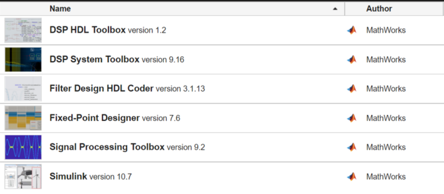
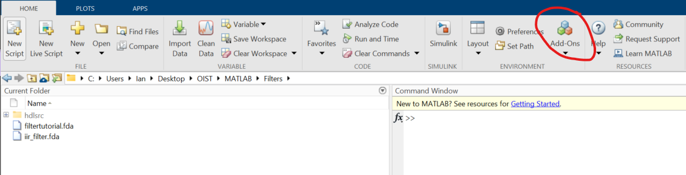
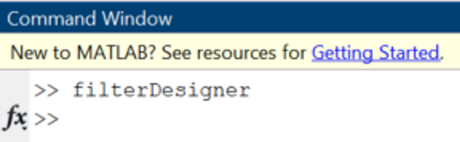
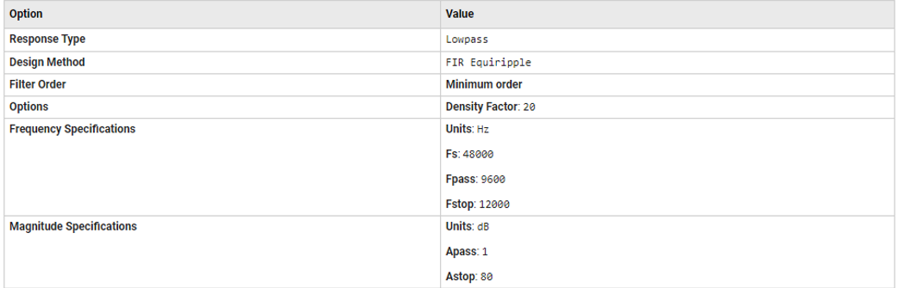
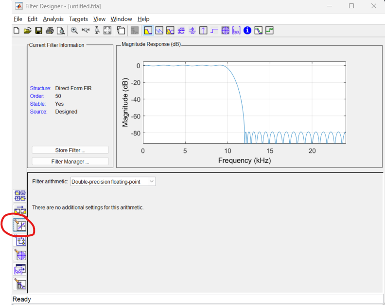
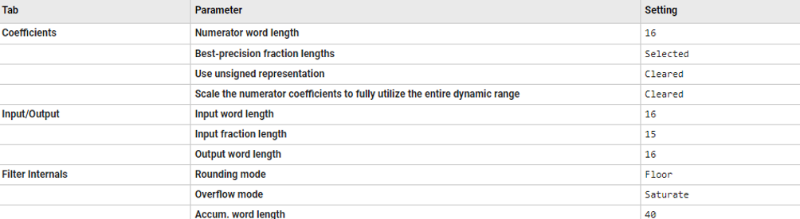
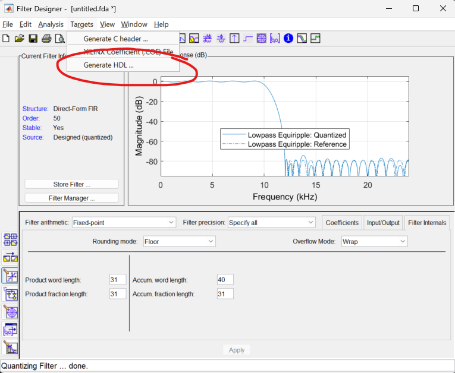
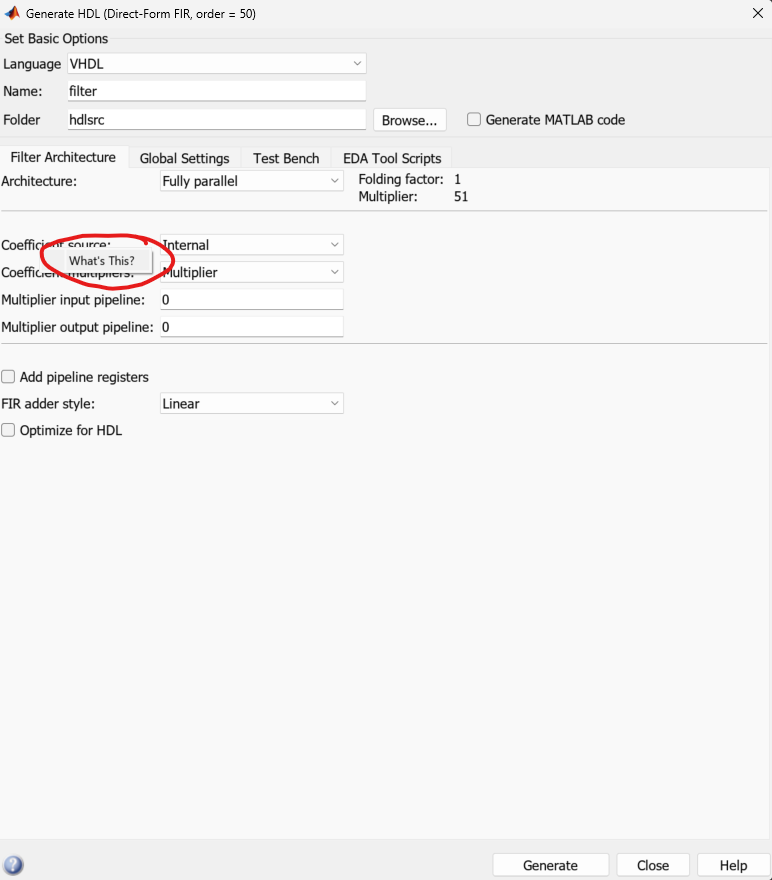

# MATLAB HDL Code Generator

To generate HDL code for FIR and IIR filters, there are two addons you will need to use, but I recommend installing all these addons since they will all be useful for HDL programming and filter design.

## Instructions

1. Assuming you have properly installed an approved version of MATLAB, launch MATLAB and install the list of addons from the above image through the "Add-Ons" button in the top task bar.

2. Once all the addons have been installed properly, start up the filter designer by entering `filterDesigner` into the command window on MATLAB.

3. You will see a new window launch, and you can customize and design what filter specifications you want using the various options available in the designer interface. For a start, try using these filter settings:

4. Once the filter specifications are set, quantize the filter for HDL generation. To do so, click the button on the left panel. 

Select the "Fixed Point" option from the filter arithmetic list, and then select "Specify All" from the filter precision list and configure the options as shown below.

5. After the filter has been quantized, navigate to the top tool bar and select "Targets", then select "Generate HDL".

6. A new window will popup. You can customize how the HDL code will be generated. If you right click on each option, you will see a "What's this?" button, where you can check the documentation and see what each parameter does.

7. Once you have selected and configured all the desired options, you can generate the code, and you will find the HDL code saved in the folder you have chosen. You can then add the filter into Vivado and incorporate it into the Red Pitaya project.

There is also an option to generate a testbench to simulate filter behavior. The MATLAB website has far more extensive documentation and examples on how to use the filter designer and HDL code generator, so please also read these resources:

## Aditional Resources
- [Introduction](https://www.mathworks.com/videos/introduction-to-filter-design-hdl-coder-68761.html)
- [Basic FIR Filter](https://www.mathworks.com/help/hdlfilter/basic-fir-filter.html)
- [Optimized FIR Filter](https://www.mathworks.com/help/hdlfilter/optimized-fir-filter.html)
- [IIR Filter](https://www.mathworks.com/help/hdlfilter/iir-filter.html)
