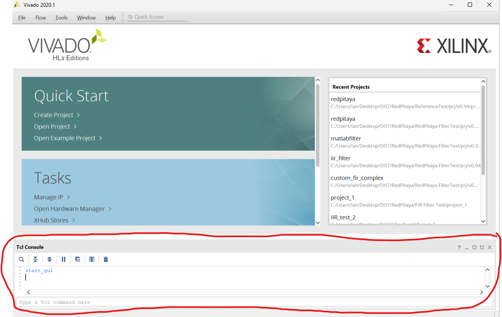
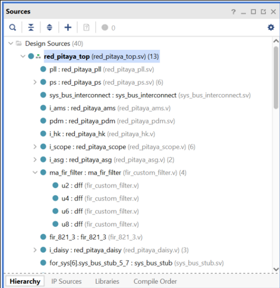
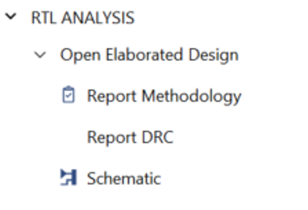
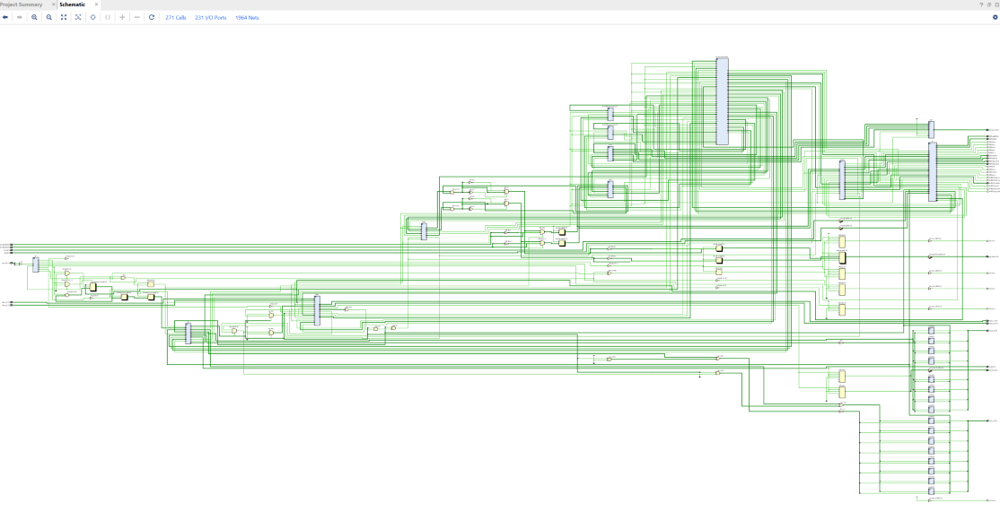
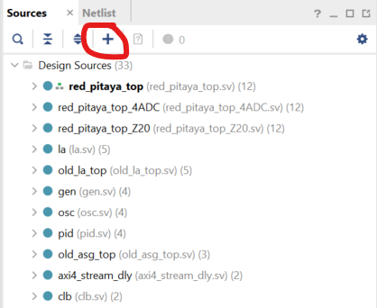
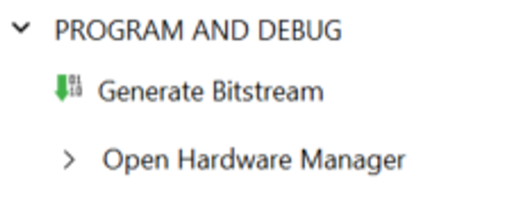
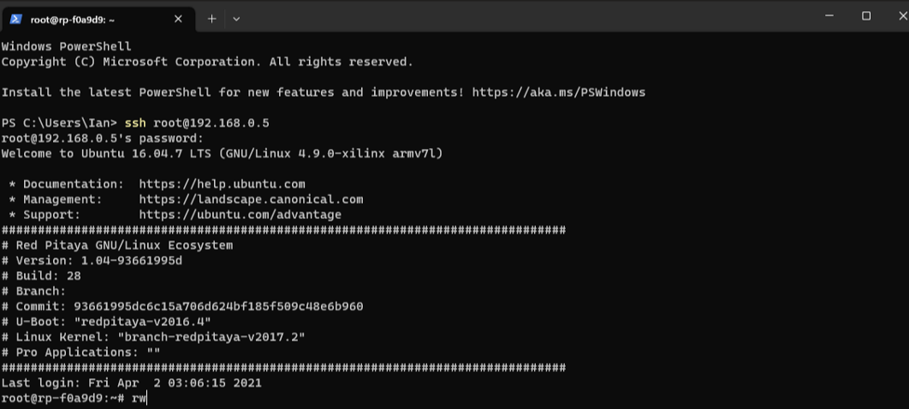

# Using Xilinx Vivado

Vivado is a software that is used for FPGA programming. The version that is required for the Red Pitaya is Vivado 2020.1. I will go through the installation procedure and provide a brief tutorial of how to use the software.

## Installation and Usage

1. **Vivado Installation**:
   - Create a [Xilinx account](https://www.amd.com/en/registration/create-account.html).
   - Required Version: Vivado 2020.1.
   - [Download Page](https://www.xilinx.com/support/download/index.html/content/xilinx/en/downloadNav/vivado-design-tools/archive.html)
   - Download the installer and follow the setup instructions.
   - Additionally, follow the installation instructions on the [Red Pitaya website](https://redpitaya-knowledge-base.readthedocs.io/en/latest/learn_fpga/3_vivado_env/tutorfpga1.html).
   - Depending on your OS, you might need to install certain packages.


2. **RedPitaya-FPGA-Master.zip**:
   - Download from the shared folder on Microsoft Teams (Documents/Rotation+Interns/IanHeung).
   - Move the folder to an easily accessible location.
   
   > **Note**: You can also download from [this](https://github.com/RedPitaya/RedPitaya-FPGA) repository as a ZIP file and extract it onto your computer. Be aware, the version in the shared folder might differ from the one on GitHub. This framework is essential to create a Red Pitaya project on Vivado. For those familiar with git, you can clone the GitHub repository. For more details, visit [this website](https://redpitaya-knowledge-base.readthedocs.io/en/latest/learn_fpga/3_vivado_env/tutorfpga2.html).

3. **Creating a Vivado Project**:
   - After installing Vivado and its dependencies, launch Vivado. You'll be greeted with the initial screen.
   
     
     
   - At the bottom, you should see the TCL console. Use this console to type the following commands to initiate a Red Pitaya project:
   
     ```bash
     cd /path/to/folder/RedPitaya-FPGA-master
     cmd /c "C:\Xilinx\Vivado\2020.1\settings64.sh"
     make project PRJ=v0.94 MODEL=Z10
     ```

   > **Note**: Instead of creating a project through the GUI, we utilize these commands to ensure all the modules within the Red Pitaya are incorporated.

4. When you execute the provided commands, a new instance of Vivado should start, and the Red Pitaya project will be loaded. Once the project has loaded, you should find a file named `red_pitaya_top` in the **Sources** tab. This will be the primary file you'll be working with when modifying connections and adding or removing modules.



5. On the left side, there's a section titled **RTL Analysis**. Clicking this will provide a visual schematic of the design, offering an easier understanding of how different modules are interconnected. 




6. To add new design sources, click on the "Add Sources" button. If you're utilizing the MATLAB HDL coder, this is where you'd import additional modules.



7. After incorporating all sources and making necessary changes in the code, click "Generate Bitstream" on the left. This will produce the bitstream file for uploading to the Red Pitaya.



## Transferring the Bitstream to Red Pitaya

1.**Locate Bitstream file**
- After the bitstream generation, locate the bitstream file on your device. This should typically be located at a path similar to: `C:\Users\[YourUsername]\Desktop\RedPitaya-FPGA-master\[project_name]\red_pitaya_top.bit`

2. Use terminal commands to upload the bitstream file to the Red Pitaya. Open two command prompts; one will establish an SSH connection to the Red Pitaya, while the other will transfer the bitstream.

3. Connect to the Red Pitaya with the following command:
```ssh root@your.ip.static.address```
Note: Use the static IP address you've set previously. After a successful connection, you'll need to provide the password (default is `root`).

4. After establishing an SSH connection, use the following command to grant write permissions:
```rw```

You can navigate the Red Pitaya's directory structure to ensure the correct location for the bitstream.



5. **Transferring Bitstream File**
   - To transfer the bitstream file to the Red Pitaya, use the second command prompt window you opened.
   - Navigate to where the bitstream file is located using:
     ```
     cd .\Desktop\OIST\RedPitaya\RedPitaya-FilterTest\prj\v0.94\project\redpitaya.runs\impl_1\
     ```
   - Transfer the file using SCP:
     ```
     scp .\red_pitaya_top.bit root@192.168.0.5:/opt/redpitaya/fpga
     ```
   - You will be prompted to enter the Red Pitaya password again. Once done, the bitstream file should have transferred successfully.

## Additional Resources
   - For more information about using Vivado and transferring the bitstream file, check out [this link](#) on the Red Pitaya official documentation website. (Note: replace `#` with the actual link)
